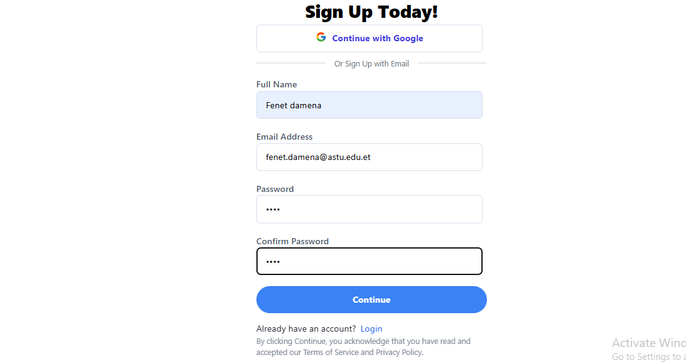
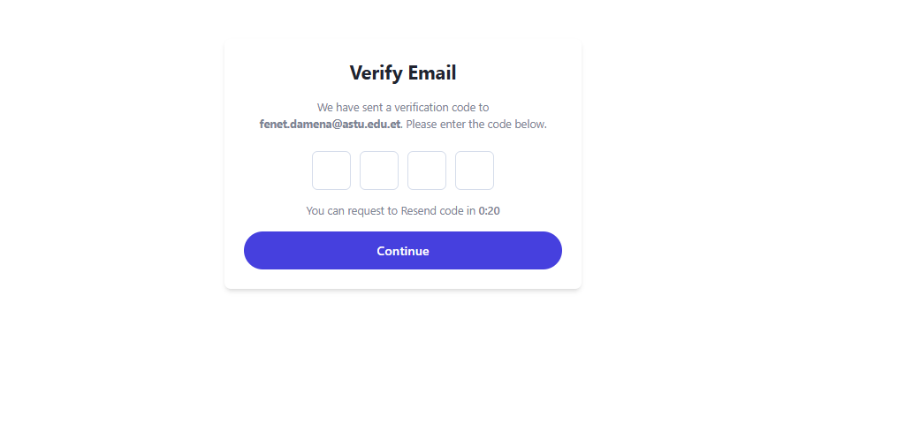
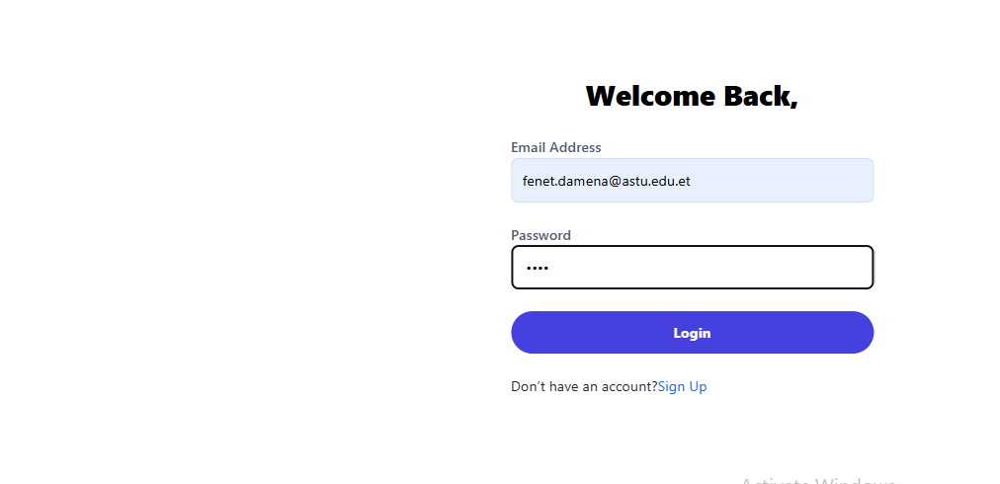
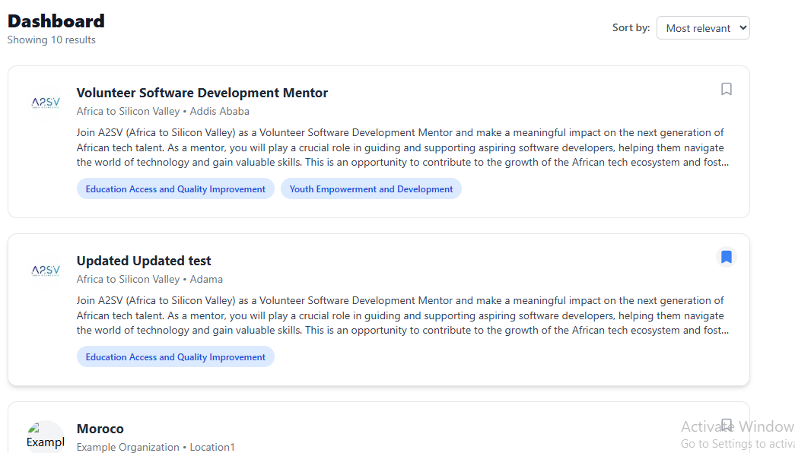
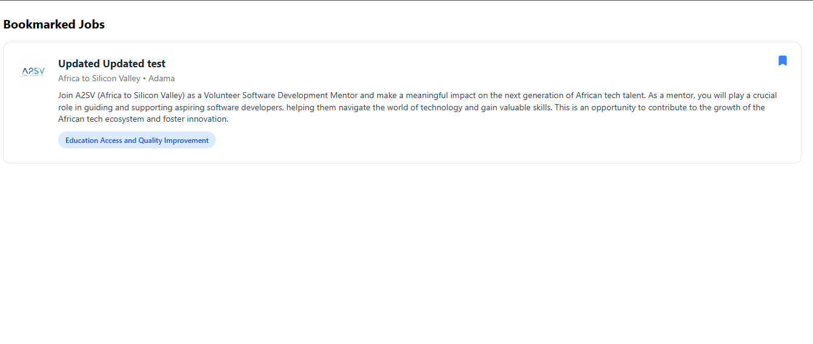

# Job Listing Application

This is a modern, responsive **Job Listing Dashboard** built with **Next.js**, **React**, **Tailwind CSS**, and **TypeScript**.  
The goal is to replicate a detailed job listing and description interface based on a Figma UI design.  
It features dynamic job data fetched directly from a remote API, clean navigation, authentication, and **bookmark functionality**.

---

## ✨ What We Implemented

* **Job Cards UI:** Reusable `JobCard` components styled to match the design exactly.  
* **Job Detail Page:** Built with proper layout, icons, fonts, and spacing following the reference.  
* **Ideal Candidate Block:** Correct layout and styling for candidate traits, age, and gender.  
* **Mobile Responsive:** Fully responsive layout optimised for different screen sizes.  
* **API Data Integration:** Job listings and details are dynamically fetched from the remote API endpoint (`https://akil-backend.onrender.com/opportunities/search`) using the native JavaScript `fetch` API.  
* **Dynamic Routing:** Implemented dynamic routes for detailed job pages based on job IDs fetched via `fetch`.  
* **Authentication System:** Built complete authentication flow with NextAuth — Sign Up, Sign In, and Email Verification — using API integration.  
* **🔖 Bookmark Functionality:**  
  - Added toggle button to each job card to allow bookmarking/unbookmarking.  
  - Integrated with backend API (`/bookmarks` endpoints) to persist user’s saved jobs.  
  - Only authenticated users can use this feature.  
  - Created a dedicated **Bookmarks Page** that lists all saved jobs.

---

## 🔐 Authentication Screenshots

### 📥 Sign Up Page  
A clean form for creating a new account, supporting both email and Google signup.  


---

### ✅ Email Verification Page  


---

### 🔐 Sign In Page  
User-friendly login form with error handling.  


---


## 🔖 Bookmark Feature

### ⭐ Bookmark Toggle on Job Card  
Users can click the bookmark icon to **add/remove jobs from bookmarks**.  


---

### 📂 Bookmarks Page  
Dedicated page showing all saved/bookmarked jobs for the logged-in user.  


---

## 🛠️ Tech Stack

* ⚛️ **Next.js** (React Framework)  
* 🎨 **Tailwind CSS** (Utility-first CSS)  
* 🔠 **TypeScript** (Typed JavaScript)  
* 🧩 **Radix UI** (Accessible UI components)  
* 📡 **API Integration** (Remote job listings API via `fetch`)  
* 🔐 **NextAuth.js** (Authentication via credentials and Google OAuth)  
* ✅ **Jest** (Unit + component testing)  
* 🧪 **Cypress** (End-to-end testing)

---

## 🚀 How to Run This Project

1. **Clone the Repository**

```bash
git clone https://github.com/Fenet-damena/a2SV-final-task.git
cd a2SV-final-task
````

2. **Install Dependencies**

```bash
npm install
```

3. **Start the Dev Server**

```bash
npm run dev
```

4. **Open in Your Browser**

👉 [http://localhost:3000](http://localhost:3000)

---

## 🧪 Testing

I implemented two types of tests for **Bookmark functionality**:

1. **Unit + Component Testing with Jest**

   * Tests the bookmark toggle button.
   * Tests rendering of JobCard and JobNotFound components.

2. **End-to-End Testing with Cypress**

   * Tests user interaction with the bookmark toggle button.
   * Verifies bookmarked jobs appear in the **Bookmarks Page**.
   * Ensures only authenticated users can access bookmarks.

To run tests:

```bash
# Run Jest unit tests
npm run test

# Run Cypress E2E tests
npx cypress open
```

---

## 👩‍💻 Author

**Fenet Damena**

